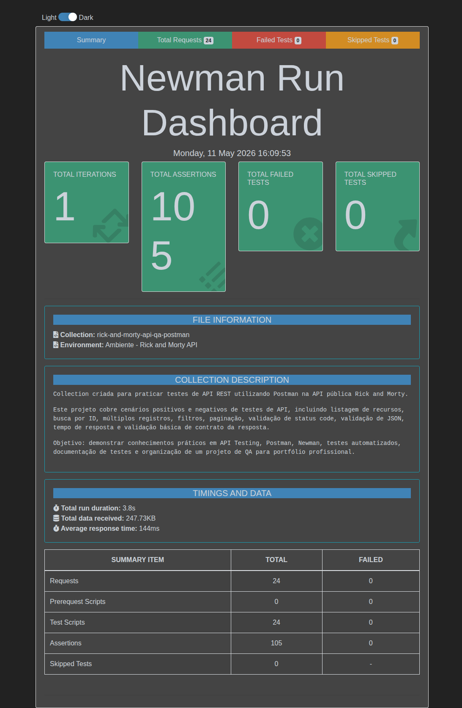

# Rick and Morty API - QA Postman Collection

Projeto de testes automatizados de API REST desenvolvido com Postman, Newman e Newman Reporter HTML Extra, utilizando a API pública Rick and Morty API.

O objetivo deste projeto é demonstrar, de forma prática e organizada, conhecimentos em API Testing, validação de respostas JSON, status codes, cenários positivos e negativos, filtros, paginação, variáveis de ambiente, execução automatizada via terminal e geração de relatório HTML.

---

## Sobre o projeto

Este repositório faz parte do meu portfólio de QA e foi criado com foco no mercado nacional, utilizando documentação em PT-BR e uma estrutura simples de entender, executar e validar.

A collection cobre os principais recursos da API Rick and Morty:

- Personagens
- Localizações
- Episódios
- Paginação

Também foram incluídos cenários negativos para validar o comportamento da API diante de IDs inexistentes.

---

## Tecnologias utilizadas

- Postman
- Newman
- Newman Reporter HTML Extra
- Node.js
- NPM
- JavaScript para scripts de validação
- JSON
- REST API

---

## Estrutura do projeto

    rick-and-morty-api-qa-postman-collection
    ├── collections
    │   └── RickAndMortyAPI.postman_collection.json
    ├── environments
    │   └── RickAndMortyAPI.postman_environment.json
    ├── docs
    ├── reports
    │   └── newman-report.html
    ├── .gitignore
    ├── package-lock.json
    ├── package.json
    └── README.md

---

## Escopo dos testes

A collection possui 24 requests organizadas em 4 grupos principais.

### Personagens

- Listar todos os personagens
- Buscar personagem por ID
- Buscar múltiplos personagens
- Filtrar personagens por status
- Filtrar personagens por nome
- Filtrar personagens por espécie
- Filtrar personagens por gênero
- Validar personagem com ID inválido

### Localizações

- Listar todas as localizações
- Buscar localização por ID
- Buscar múltiplas localizações
- Filtrar localizações por nome
- Filtrar localizações por tipo
- Filtrar localizações por dimensão
- Validar localização com ID inválido

### Episódios

- Listar todos os episódios
- Buscar episódio por ID
- Buscar múltiplos episódios
- Filtrar episódios por nome
- Filtrar episódios por código
- Validar episódio com ID inválido

### Paginação

- Validar paginação de personagens
- Validar paginação de localizações
- Validar paginação de episódios

---

## Tipos de validação implementados

Os testes automatizados validam:

- Status code esperado
- Resposta em formato JSON
- Tempo de resposta abaixo de 2000ms
- Existência de propriedades obrigatórias
- Estrutura básica dos contratos de resposta
- Objetos de paginação
- Listas de resultados
- Filtros por query params
- Busca por ID
- Busca por múltiplos IDs
- Cenários negativos com retorno 404
- Mensagens de erro em respostas negativas

---

## Variáveis de ambiente

O projeto utiliza um environment do Postman com variáveis para facilitar a manutenção dos testes.

Principais variáveis:

    url_base
    id_personagem
    ids_personagens
    nome_personagem
    status_personagem
    especie_personagem
    genero_personagem
    id_localizacao
    ids_localizacoes
    nome_localizacao
    tipo_localizacao
    dimensao_localizacao
    id_episodio
    ids_episodios
    nome_episodio
    codigo_episodio
    numero_pagina
    id_invalido

A variável principal da API é:

    url_base = https://rickandmortyapi.com/api

---

## Como executar o projeto

### Pré-requisitos

Antes de executar os testes, é necessário ter instalado:

- Node.js
- NPM

### Instalação

Clone o repositório:

    git clone https://github.com/JuniorSantosDev86/rick-and-morty-api-qa-postman-collection.git

Acesse a pasta do projeto:

    cd rick-and-morty-api-qa-postman-collection

Instale as dependências:

    npm install

---

## Executar os testes via Newman

Para rodar a collection pelo terminal:

    npm run test:api

Esse comando executa a collection utilizando o environment configurado:

    newman run collections/RickAndMortyAPI.postman_collection.json -e environments/RickAndMortyAPI.postman_environment.json

---

## Gerar relatório HTML

Para executar os testes e gerar um relatório HTML:

    npm run report:api

O relatório será gerado em:

    reports/newman-report.html

Para abrir o relatório no Linux:

    xdg-open reports/newman-report.html

---

## Resultado da execução

A collection foi executada com sucesso via Newman.

Resumo da execução principal:

    Requests executadas: 24
    Assertions executadas: 105
    Falhas: 0
    Duração total: 3.8s
    Tempo médio de resposta: 144ms
    Menor tempo de resposta: 27ms
    Maior tempo de resposta: 630ms

Também foi realizada uma execução anterior com sucesso, contendo 24 requests, 105 assertions e 0 falhas. Essa execução teve duração total de 6.9s e tempo médio de resposta de 273ms.

---

## Relatório Newman

O projeto inclui geração de relatório HTML utilizando o newman-reporter-htmlextra.

O relatório apresenta informações como:

- Total de requests executadas
- Total de assertions
- Status dos testes
- Tempo de resposta
- Detalhamento por pasta
- Detalhamento por request
- Resultado individual de cada validação

Arquivo gerado:

    reports/newman-report.html

---

## Evidência da execução

Abaixo está uma evidência visual da execução da collection via Newman, com 24 requests executadas, 105 assertions e 0 falhas.

## Observação técnica

Durante os testes do filtro por espécie em personagens, foi identificado que a API realiza busca parcial.

Ao pesquisar por:

    human

A API pode retornar espécies como:

    Human
    Humanoid

Por esse motivo, a validação foi ajustada para verificar se o valor retornado contém o termo pesquisado, em vez de exigir igualdade exata.

Exemplo da validação aplicada:

    pm.expect(personagem.species.toLowerCase()).to.include(especiePesquisada);

Essa decisão evita falso negativo no teste e respeita o comportamento real da API.

---

## Exemplo de teste implementado

    pm.test("Deve retornar status code 200", function () {
      pm.response.to.have.status(200);
    });

    pm.test("A resposta deve estar em formato JSON", function () {
      pm.response.to.be.json;
    });

    pm.test("O tempo de resposta deve ser menor que 2000ms", function () {
      pm.expect(pm.response.responseTime).to.be.below(2000);
    });

---

## Scripts disponíveis

No package.json, foram configurados os seguintes scripts:

    "scripts": {
      "test:api": "newman run collections/RickAndMortyAPI.postman_collection.json -e environments/RickAndMortyAPI.postman_environment.json",
      "report:api": "newman run collections/RickAndMortyAPI.postman_collection.json -e environments/RickAndMortyAPI.postman_environment.json -r cli,htmlextra --reporter-htmlextra-export reports/newman-report.html"
    }

---

## Objetivo profissional

Este projeto foi desenvolvido para demonstrar competências práticas em QA, especialmente em testes de API REST.

Competências demonstradas:

- Criação de collection no Postman
- Organização de cenários de teste
- Uso de variáveis de ambiente
- Escrita de scripts de validação
- Validação de status code
- Validação de payload JSON
- Validação básica de contrato
- Validação de filtros e paginação
- Testes positivos e negativos
- Execução automatizada com Newman
- Geração de relatório HTML
- Documentação técnica em PT-BR

---

## Autor

Ademir dos Santos Junior

QA | Testes de Software | API Testing | Postman | Newman | Cypress | Testes Manuais e Automatizados

GitHub: https://github.com/JuniorSantosDev86

---

## Licença

Este projeto está sob a licença MIT.